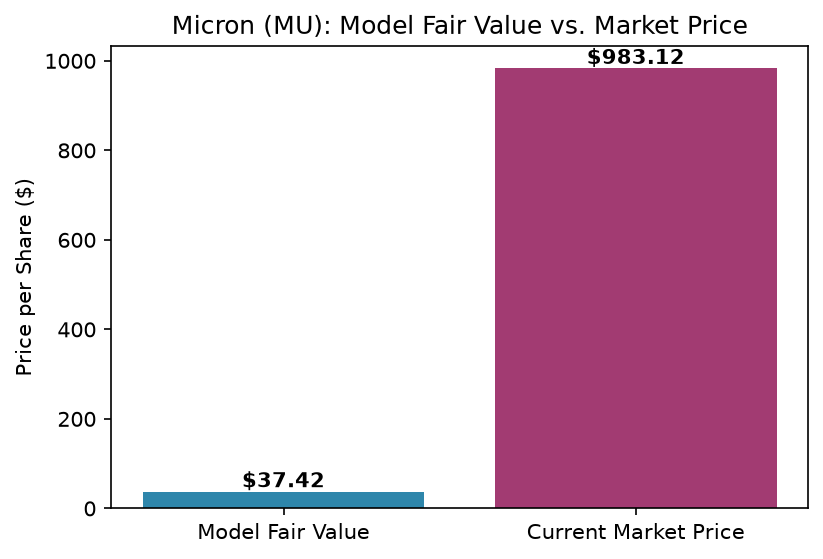

# equity-research-dcf-model
DCF valuation model for Micron Technology (MU) built in Python - pulls financial data, projects free cash flow, and estimates fair value per share.

## Sample Output

=== FINAL RESULT ===
Fair Value Per Share: $37.42
Current Market Price: $983.12
Verdict: Potentially OVERVALUED based on this model